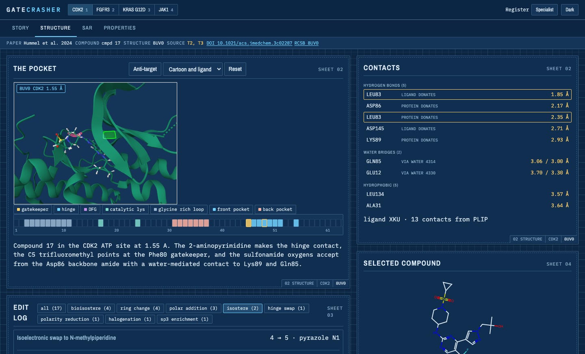

# 🧬 GATECRASHER

> **Four drug discovery campaigns, opened up: the pocket, the structure-activity relationships, the chemical edits, and the structural basis of selectivity.**

[](https://gatecrasher.mdeller.com)


| | |
|---|---|
| 🌐 **App** | [gatecrasher.mdeller.com](https://gatecrasher.mdeller.com) |
| ✉️ **Contact** | [marc@marcdeller.com](mailto:marc@marcdeller.com) |
| 📦 **Repository** | [github.com/bellcheddar/GATECRASHER](https://github.com/bellcheddar/GATECRASHER) |



**Why it matters:** a published medicinal chemistry paper tells you what was made and what it did, but the reasoning that connects one compound to the next is spread across tables, figures and a supporting information file, and the structural basis for it sits in a database somewhere else. GATECRASHER puts them in one place and makes them click through to each other: select a residue in three dimensions and the compound table filters to the molecules whose edits cite it; select a compound and its ligand appears in the pocket, its point lights up on every plot, and the edit log scrolls to the changes that made it. Every number on screen carries the table or figure it came from, and the build fails if one does not. It is useful for anyone who wants to see how a drug was actually designed: structural biologists and medicinal chemists who want the contacts and the R-group tables, and everyone else who wants to understand in thirty seconds what the molecule does and why it was hard.

## 🔬 The four campaigns

Each is a selectivity problem solved at a pocket, then carried over the line by property work.

| Campaign | Target, and what had to be spared | Structures | The move it turns on |
|---|---|---|---|
| **CDK2** (Hummel *et al.* 2024) | CDK2/cyclin E1, sparing CDK1, 4, 6, 7, 9 | [8UV0](https://www.rcsb.org/structure/8UV0) | A screening hit that was really a JAK2 inhibitor: an sp3 aminopiperidine erased JAK2 and found CDK2 |
| **FGFR2/3** (Shvartsbart *et al.* 2022) | FGFR2 and FGFR3 including gatekeeper mutants, sparing FGFR1 | [8E1X](https://www.rcsb.org/structure/8E1X), [4K33](https://www.rcsb.org/structure/4K33) | A hydrogen bond designed on a docking model, then confirmed and partly contradicted by the crystal structure |
| **KRAS G12D** (Ye *et al.* 2025) | KRAS G12D, sparing wild-type KRAS | [9E5F](https://www.rcsb.org/structure/9E5F), [9E5D](https://www.rcsb.org/structure/9E5D) | A thousand-fold of binding potency given away on purpose, for oral exposure |
| **JAK1** (Zhuo *et al.* 2026) | JAK1, sparing JAK2 | [10PI](https://www.rcsb.org/structure/10PI), [10PJ](https://www.rcsb.org/structure/10PJ) | One ligand crystallised in both the target and the anti-target: the only true twin in the set |

Marc C. Deller is a co-author on all four papers, contributing the protein crystallography.

## 📊 What is in the bundles

| | |
|---|---|
| Compounds | 91, every one with a verified structure |
| Measurements | 859, each carrying the table or figure it was printed in |
| Structures | 7 deposited entries |
| Residues | 1,786 annotated with secondary structure and motif |
| Edits | 56 designed changes, with their consequences and structural basis |
| Story beats | 20, in a specialist and a plain register |

## 🧪 How a structure gets into this app

No compound structure in this repository was drawn by hand and trusted. Each one is verified, and the notes column of every `compounds.tsv` records **how strongly**:

| Strength | Meaning |
|---|---|
| `ligand-verified` | Matches the chemical component deposited in the PDB, atom for atom |
| `name-verified` | The paper's own IUPAC name, parsed with OPSIN, agrees atom for atom |
| `source-verified` | Fetched from PubChem and checked against the published formula |
| `anchor-derived` | Built with RDKit `molzip` from a verified core by one documented substitution |
| `figure-derived` | Read from a drawing, with no name and no coordinates to check it against. The weakest, and flagged as such wherever it appears |

**A molecular formula check is not enough, and this is not a theoretical concern.** While curating the FGFR bundle, a hand-built scaffold reproduced the paper's published formula exactly while having the wrong connectivity: in a SMILES prefix fragment the bond to the next atom comes from the fragment's *last* atom, so every cyclic ether had attached through a ring carbon with its oxygen left dangling. Same atoms, wrong molecule, identical formula. Only comparing against the structure parsed from the published name caught it. Fragments are now joined with `molzip` at labelled attachment points, and the scheme is proved by rebuilding each verified anchor exactly.

The same principle governs what gets drawn in the pocket: every distance in the app comes from a PLIP measurement on real coordinates, and nothing is hand-placed. A contact whose atoms cannot be located is listed but never drawn, because a measure line without a measurement is the one thing this drawing grammar forbids.

## 🧲 What the dynamics are for

The crystal structure is one pose at one temperature. The short molecular dynamics run asks a narrower and more useful question: **does the contact the paper leans on actually hold?**

Each primary structure gets a run under amber14-all with TIP3P water, the ligand parameterised by the Open Force Field small-molecule force field (openff-2.1.0) with AM1-BCC charges, in a 1 nm box at 0.15 M NaCl, 300 K, 2 fs steps with hydrogen mass repartitioning at 4 amu, a Monte Carlo barostat, 200 ps of restrained equilibration released in five steps, then 5 ns of production sampled every 20 ps.

Each run carries the paper's own claims, written as testable statements before the run starts, and each is scored against thresholds fixed in advance:

| Claim shape | Passes when |
|---|---|
| A contact the paper says is present | Held in at least **50%** of frames |
| A contact the paper says is absent | Present in at most **20%** of frames |
| The ligand stays where it was crystallised | Median heavy-atom RMSD to the crystal pose at most **2 Å** |

**A trajectory that fails its claims is not published.** The verdict is written either way, so the page can say what was run and what it showed, rather than offering a control that quietly does nothing. This runs in both directions in practice: the KRAS paper's assertion that the ligand does not contact Asp12 is reproduced at 0% occupancy, and a deliberately impossible claim, added as a control, correctly withheld its trajectory.

Where a run passes, the page gains a per-residue RMSF band on the pocket ruler and a decimated trajectory of the pocket and ligand that plays in the viewer.

## ⚖️ What this app does not reproduce

No publisher figure, graphical abstract or full text is reproduced here. Every molecule is drawn from SMILES with RDKit, every structure is rendered from coordinates fetched from the RCSB PDB, and the narrative is written fresh. Abstracts are quoted verbatim in a marked quotation block with their citation and DOI, which is ordinary scholarly quotation. The paper PDFs themselves are not in this repository and never will be.

Where a paper's only record of something is a figure we may not copy, the app says so plainly rather than inventing a substitute: the KRAS paper's model of its final compound is described and not shown, because no coordinates exist for it.

## 🏗️ Running the pipeline

`pipeline/` runs on the Mac and never ships; `web/` is what gets deployed, as vanilla ES modules with no build step and no server. Curated source tables live in `pipeline/raw/<slug>/`, published bundles in `web/data/papers/<slug>/`.

```
gc extract  <slug> --pdf <file> --pages 1-10   # text and page images, for hand transcription
gc chem     <slug>                             # descriptors, scaffold, core-aligned depictions
gc struct   <slug>                             # mmCIF, DSSP, KLIFS, PLIP contacts
gc dynamics <slug> --stage all                 # OpenMM run, RMSF track, claim verdicts
gc bundle   <slug>                             # melt the published tables into web/data/
gc validate [slug]                             # schema, provenance, chemistry, cross-references
gc all      <slug>                             # the pipeline, in order
```

### The validation gate

`gc validate` fails the build, not a warning, when: a measurement has no `source_table`; an InChIKey does not match its SMILES; two compounds are the same molecule; an R-group fragment is not actually present in its parent; a residue cited by an edit, a story beat or a contact does not exist in the structure it is cited against; or an assay, compound or edit id is referenced but not defined.

## ✅ To Do

Roadmap, roughly in dependency order.

- [x] **Data contract.** Long-format measurements, per-paper assay dictionaries, JSON Schema for every artefact, and a provenance gate that fails the build rather than warning
- [x] **CDK2 end to end.** 18 compounds, 251 measurements, 8UV0 with PLIP contacts and the KLIFS pocket ruler, as the shape every later bundle had to fit
- [x] **All four campaigns.** FGFR, KRAS and JAK1 curated, including the non-kinase path for KRAS where there is no KLIFS numbering, and the twin-structure anti-target for JAK1
- [x] **Chemical verification.** OPSIN name-to-structure checking and `molzip` fragment assembly on verified cores, after a formula check passed a molecule with the wrong connectivity
- [x] **Structural annotation.** DSSP secondary structure, KLIFS pocket numbering, PLIP contacts per structure, and a gate that every cited residue exists in the coordinates it is cited against, which caught a hinge labelled on an arginine
- [x] **Selectivity analysis.** The anti-target twin view with the two structures superposed before drawing, the selectivity matrix, and activity cliffs ranked from the primary potency only
- [x] **Papers checked against themselves.** An `ISSUES.md` per bundle recording every internal contradiction, both readings kept and neither averaged
- [x] **In-browser search.** BM25 over this project's own prose and data, indexed once on the Mac and scored in the page, with "not stated in this project" as a first-class answer. Embeddings were the plan, but a static site cannot embed a query without a server or a model shipped to the page
- [x] **Take the view away.** A PyMOL script, session and still image per structure, so the pocket leaves the browser
- [x] **Gates in CI.** The schema, provenance, chemistry and cross-reference checks run on every push, along with the copy gate, so a bundle that contradicts itself cannot reach the branch. Proved by breaking one on purpose: a blanked `source_table` fails the build rather than warning, which is the behaviour the gate exists for
- [ ] **Short molecular dynamics.** A 5 ns run per primary structure with an RMSF track on the pocket ruler and a playable trajectory, and no trajectory ships that does not support what the paper claims. The verdict logic is proved in both directions; the production runs are in progress
- [ ] **Per-residue dynamics on the anti-target.** The twin view compares two crystal poses; comparing their flexibility is the obvious next question and is not answered yet

## 📚 Citations

| Campaign | Citation |
|---|---|
| CDK2 | Hummel J. R., Xiao K.-J., Yang J. C., Epling L. B., Mukai K., Ye Q., Xu M., Qian D., Huo L., Weber M., Roman V., Lo Y., Drake K., Stump K., Covington M., Kapilashrami K., Zhang G., Ye M., Diamond S., Yeleswaram S., Macarron R., **Deller M. C.**, Wee S., Kim S., Wang X., Wu L., Yao W. *J. Med. Chem.* **2024**, 67, 3112-3126. [10.1021/acs.jmedchem.3c02287](https://doi.org/10.1021/acs.jmedchem.3c02287) |
| FGFR2/3 | Shvartsbart A., Roach J. J., Witten M. R., Koblish H., Harris J. J., Covington M., Hess R., Lin L., Frascella M., Truong L., Leffet L., Conlen P., Beshad E., Klabe R., Katiyar K., Kaldon L., Young-Sciame R., He X., Petusky S., Chen K.-J., Horsey A., Lei H.-T., Epling L. B., **Deller M. C.**, Vechorkin O., Yao W. *J. Med. Chem.* **2022**, 65, 15433-15442. [10.1021/acs.jmedchem.2c01366](https://doi.org/10.1021/acs.jmedchem.2c01366) |
| KRAS G12D | Ye Q., Shvartsbart A., Li Z., Gan P., Policarpo R. L., Qi C., Roach J. J., Zhu W., McCammant M. S., Hu B., Li G., Yin H., Carlsen P., Hoang G., Zhao L., Susick R., Zhang F., Lai C.-T., Allali Hassani A., Epling L. B., Gallion A., Kurzeja-Lipinski K., Gallagher K., Roman V., Farren M. R., Kong W., **Deller M. C.**, Zhang G., Covington M., Diamond S., Kim S., Yao W., Sokolsky A., Wang X. *J. Med. Chem.* **2025**, 68, 1924-1939. [10.1021/acs.jmedchem.4c02662](https://doi.org/10.1021/acs.jmedchem.4c02662) |
| JAK1 | Zhuo J., Li Y.-L., Qian D.-Q., Burns D. M., Mei S., Rafalski M., Xu M., Cao G., Pan Y., Jia Z., Jalluri R., Epling L. B., Fenalti G., **Deller M. C.**, Procak J., Covington M., He X., Collins R., Stubbs M., Burke K., Oliver J., Margulis A., Boer J., Wynn R., Scherle P., Diamond S., Newton R., Zhang Y., Metcalf B., Yao W. *J. Med. Chem.* **2026**. [10.1021/acs.jmedchem.5c03753](https://doi.org/10.1021/acs.jmedchem.5c03753) |

## 🛠️ Software this stands on

| Tool | Used for | Licence |
|---|---|---|
| [RDKit](https://www.rdkit.org/) | Descriptors, MCS, core-aligned depictions, fragment assembly | BSD-3-Clause |
| [OPSIN](https://github.com/dan2097/opsin) | Turning the papers' IUPAC names into structures, for verification | MIT |
| [PLIP](https://github.com/pharmai/plip) | Protein-ligand interaction profiling | GPL-2.0, invoked as a subprocess and never imported |
| [gemmi](https://gemmi.readthedocs.io/) | mmCIF handling and structure superposition | MPL-2.0 |
| [biotite](https://www.biotite-python.org/) | Structure handling | BSD-3-Clause |
| [DSSP](https://github.com/PDB-REDO/dssp) | Secondary structure | BSD-2-Clause |
| [Open Babel](https://openbabel.org/) | Chemical perception inside PLIP | GPL-2.0, reached only inside the PLIP subprocess |
| [OpenMM](https://openmm.org/) | The molecular dynamics engine | LGPL-3.0-or-later, run as a subprocess under a separate interpreter |
| [OpenFF Toolkit](https://github.com/openforcefield/openff-toolkit) | Ligand parameters with AM1-BCC charges | MIT |
| [PDBFixer](https://github.com/openmm/pdbfixer) | Missing atoms and protonation before solvation | MIT |
| [MDTraj](https://mdtraj.org/) | RMSF, ligand RMSD and contact occupancy from the trajectories | LGPL-2.1-or-later, run as a subprocess under a separate interpreter |
| [PyMOL](https://github.com/schrodinger/pymol-open-source) | The downloadable script, session and still per structure | Open-Source PyMOL licence, invoked as a subprocess |
| [pypdfium2](https://github.com/pypdfium2-team/pypdfium2) | Text and page images out of the PDFs, on the Mac only | BSD-3-Clause / Apache-2.0 |
| [Mol\*](https://molstar.org/) | The structure viewer | MIT |
| [Plotly.js](https://plotly.com/javascript/) | Every figure | MIT |
| [RDKit.js](https://github.com/rdkit/rdkit-js) | In-browser depiction and highlighting | BSD-3-Clause |
| [KLIFS](https://klifs.net/) | Kinase pocket numbering | Academic use |
| [RCSB PDB](https://www.rcsb.org/) | All coordinates | Public domain |
| [PubChem](https://pubchem.ncbi.nlm.nih.gov/) | Reference drug structures | Public domain |

GATECRASHER is released under the [MIT licence](LICENSE). Nothing copyleft is linked in: the GPL and LGPL tools above are each invoked as a subprocess and never imported, and none of them reaches the browser. Versions, roles, references and the licence notices for the vendored libraries are in [`THIRD_PARTY.md`](THIRD_PARTY.md), which is generated from the same `web/data/software.json` the About sheet renders.

---

Built by [Marc C. Deller, D.Phil.](https://marcdeller.com) · [marc@marcdeller.com](mailto:marc@marcdeller.com)
